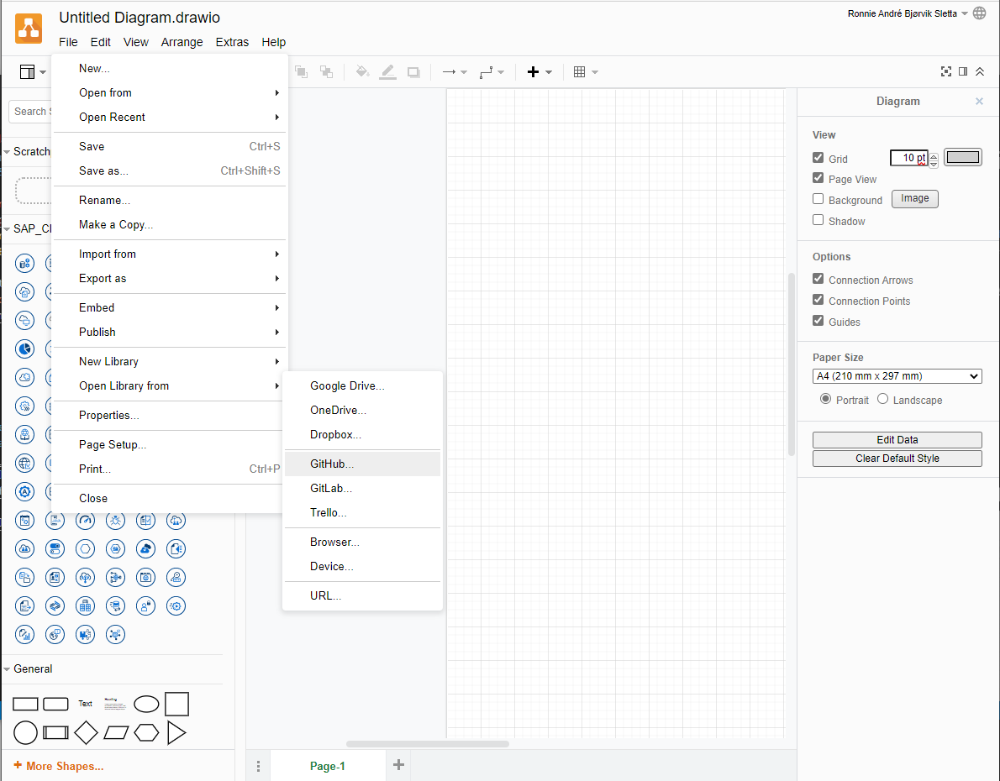
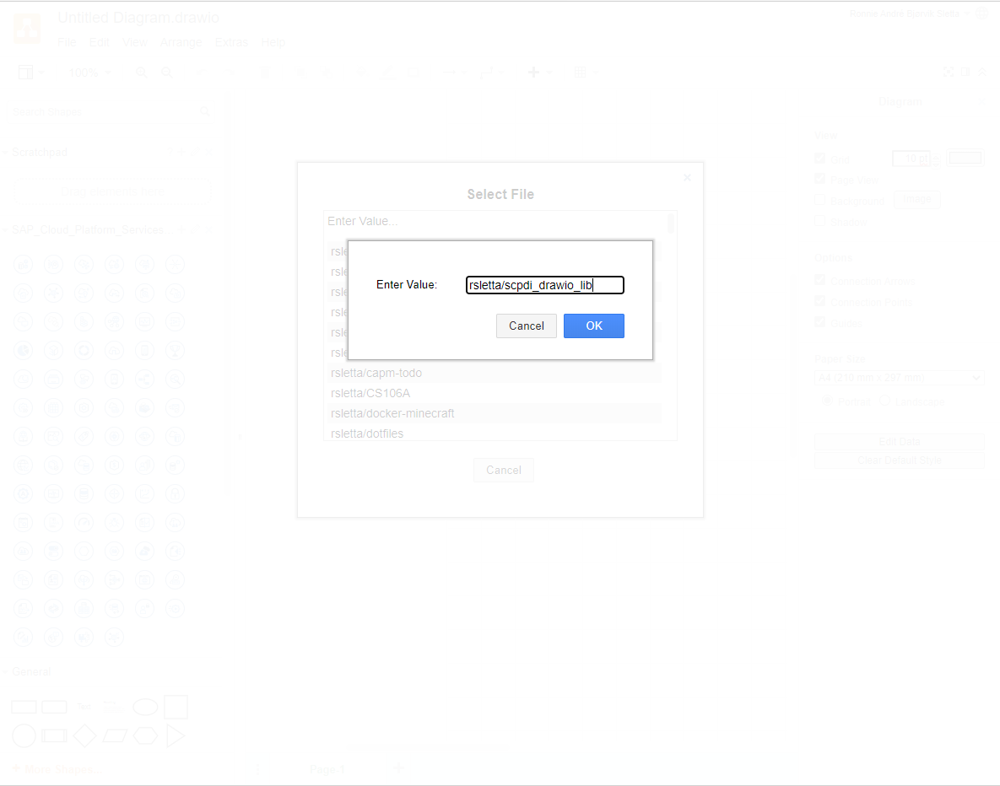
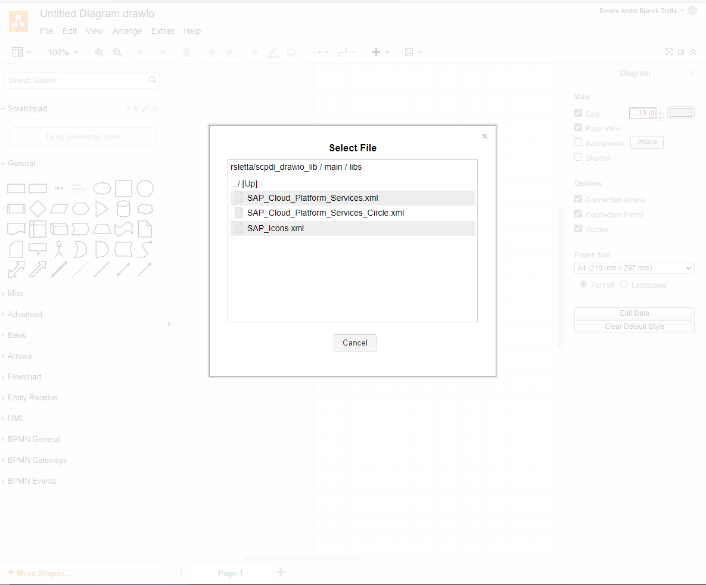
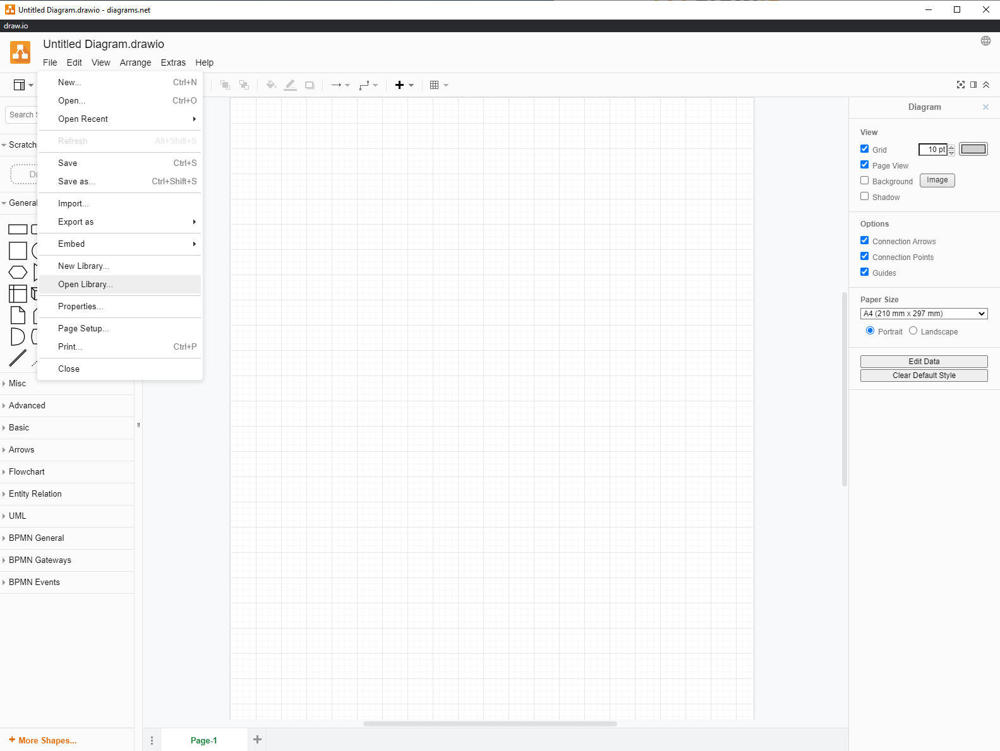
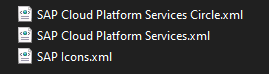
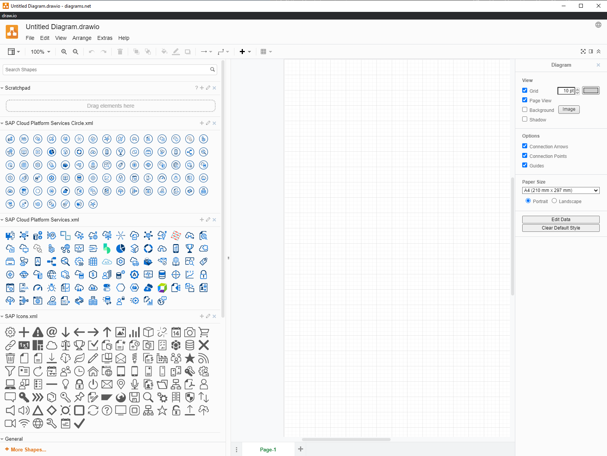

# SAP Cloud Platform Solution Diagrams &amp; Icons - Custom draw.io library

Custom library for [Draw.io](https://app.diagrams.net/), based on [SAP Cloud Platform Solution Diagrams & Icons](https://wiki.scn.sap.com/wiki/pages/viewpage.action?pageId=477829554). These libraries are made for convenience and may be retracted at any time, on discretion by SAP SE. All rights reserved SAP SE. The SAP Materials and all copies shall remain at all times the exclusive property of SAP SE
and/or an SAP affiliate company. The SAP Terms of Use found in document [Terms Of Use for the SAP Cloud Platform Solution Diagrams, Design Elements & Icons](https://d.dam.sap.com/a/nXJJmw/SAP%20Cloud%20Platform%20Diagrams%20and%20Icons%20Terms%20of%20Use.pdf) govern your use of these SAP materials (as defined in the Terms of Use), and related Content and web pages.

## Usage online

### ### Select "Open Library/Github" from "File" menu
 
### Press "Enter Value" and enter repository name "rsletta/scpdi_drawio_lib"

### Select library file from main branch / libs

## Usage desktop

### Download [Zip-file](SCP_Diagram_icons_Drawio_library.zip)
### Select "Open Library" from "File" menu
 
### Select library file to import

## Common 
### Use assets with drag and drop 😊
