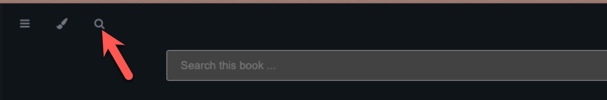

# How to use

Look through the templates or use the search to search for keywords or templates.



Each template will have a short description and an image that shows the template. The link will open up diagrams.net and the template for you to continue working on it.

# Contribute

If you have a template that you would like to share with the community. You will need to download your architecture diagram in XML format from diagrams.net or draw.io. Open the Github editor via this [link](https://github.dev/rsletta/sap_btp_icons_drawio_lib) or fork the [repository](https://github.com/rsletta/sap_btp_icons_drawio_lib) and add your xml file into upload directory and create a pull request and fill out the details requested. These details are used to create the page that shows the template.

If the pull request doesn't add the template automatically, then please use the following template

```
# Title

[Title]

# Description

[Description]

# Image
[Paste a copy of your image]

# Tags

[Add any relevant tags]
```